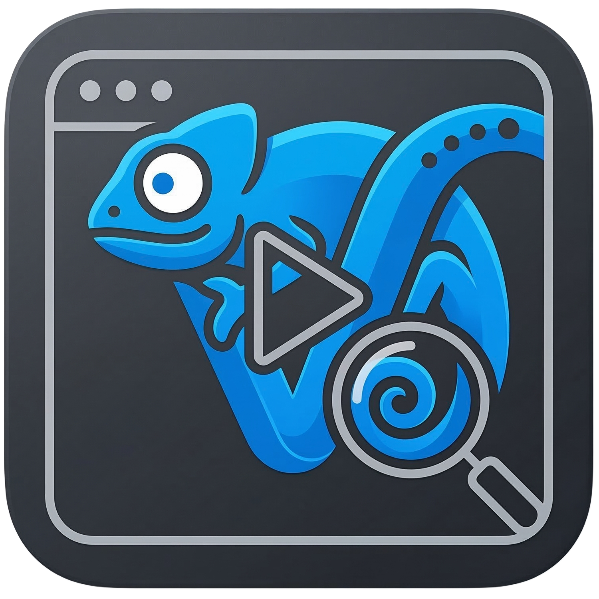
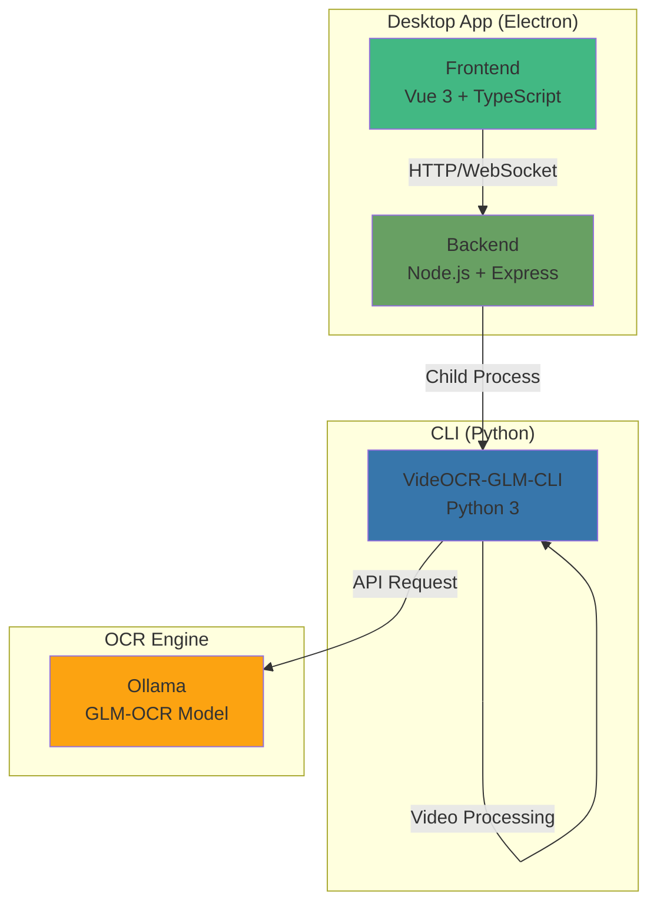
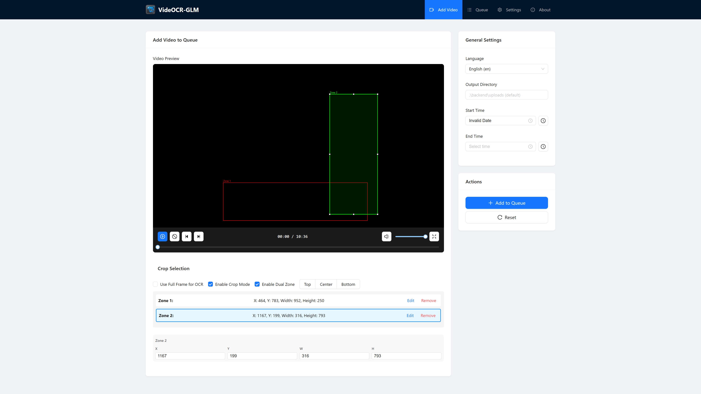
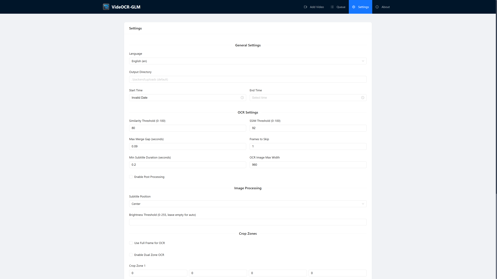
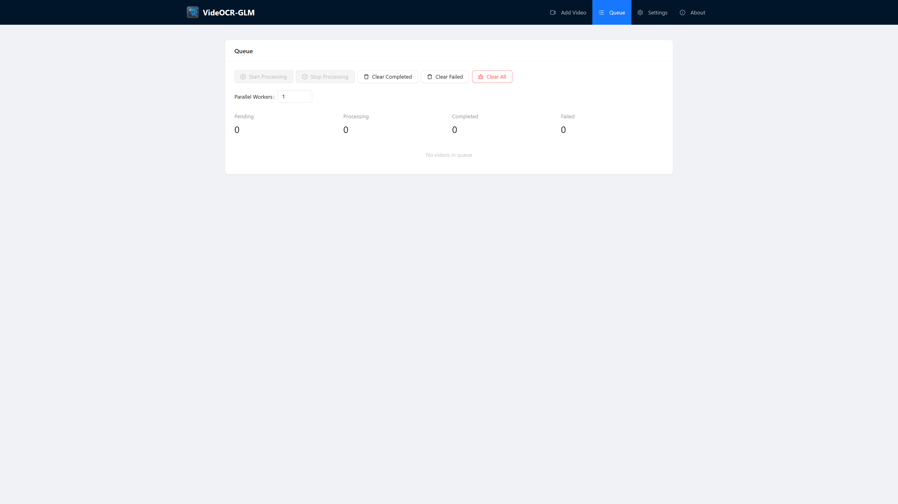
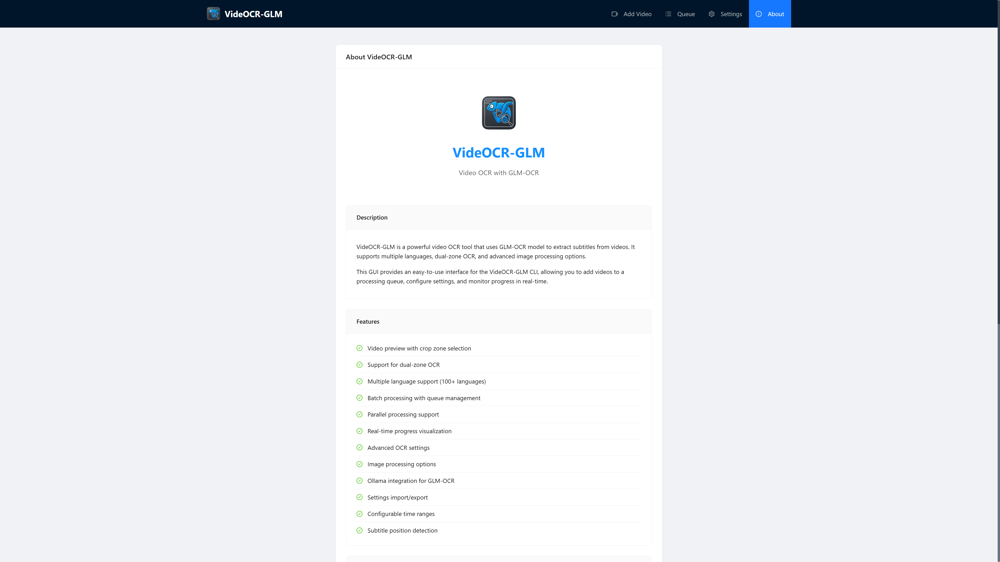

# VideOCR-GLM

<div align="center">




**A modern video OCR application with GLM-OCR support, featuring CLI, Web GUI, and Desktop interfaces**

[📥 Download Latest Release](https://github.com/Benson-mk/VideOCR-GLM/releases) • [Features](#features) • [Quick Start](#quick-start) • [Installation](#installation) • [Usage](#usage) • [Documentation](#documentation)
</div>

---

## About
VideOCR-GLM is a powerful video OCR (Optical Character Recognition) application that extracts hardcoded (burned-in) subtitles from videos using GLM-OCR technology. It provides three flexible interfaces to suit different use cases:
- **Web GUI**: Modern Vue 3 interface for easy visual operation
- **Desktop App**: Click-to-run Electron application for standalone use
- **CLI**: Command-line tool for automation and batch processing
Perfect for content creators, researchers, and anyone who needs to extract subtitles from videos in over 100 languages.

---

## Architecture


**Architecture Overview:**
- **Frontend (Vue 3)**: Modern web interface for video preview, crop zone selection, and queue management
- **Backend (Node.js + Express)**: RESTful API server with WebSocket support for real-time progress updates
- **CLI (Python)**: Video processing engine that extracts subtitles using GLM-OCR
- **Ollama**: Local AI runtime hosting the GLM-OCR model for optical character recognition
- **Electron**: Desktop application wrapper that packages frontend and backend into a standalone app
**Data Flow:**
1. User uploads video and configures settings in the Frontend
2. Frontend sends request to Backend via HTTP/WebSocket
3. Backend spawns CLI process with video and configuration
4. CLI processes video frames and sends them to Ollama for OCR
5. Ollama returns recognized text to CLI
6. CLI generates SRT file and streams progress to Backend
7. Backend broadcasts progress to Frontend via WebSocket
8. Frontend displays real-time progress and results to user
---
## Features
### 🎬 Video Preview & OCR
- **Interactive Video Preview** - Preview videos with playback controls
- **Visual Crop Zone Selection** - Click and drag to select subtitle regions
- **Dual Zone OCR** - Support for two separate subtitle regions
- **Preset Crop Positions** - Quick selection of top, center, or bottom positions
- **Full Frame OCR** - Option to use entire frame for OCR
### 📋 Queue Management
- **Batch Processing** - Add multiple videos to a processing queue
- **Parallel Processing** - Process multiple videos simultaneously (1-10 workers)
- **Real-time Progress** - Visual progress bars for each video
- **Queue Persistence** - Queue items persist across browser sessions
- **Retry Failed Items** - Easily retry failed processing attempts
### ⚙️ Advanced Configuration
- **100+ Languages** - Support for multiple OCR languages
- **OCR Parameters** - Fine-tune similarity threshold, SSIM threshold, frame skipping
- **Image Processing** - Brightness threshold, full frame options
- **Ollama Integration** - Configure host, port, model, and timeout
- **Settings Management** - Save, load, and export settings
- **Time Range Selection** - Process specific video segments
### 🎨 Modern Interface
- **Responsive Design** - Works on desktop and tablet devices
- **Dark/Light Theme** - Modern UI with Ant Design Vue components
- **Real-time Updates** - WebSocket-based progress updates
- **Error Handling** - Clear error messages and troubleshooting guidance
---
## Screenshots
### Add Video to Queue

Video preview with interactive crop zone selection, dual zone support, and comprehensive settings configuration.
### Settings

Complete settings management with OCR parameters, image processing options, Ollama configuration, and system settings.
### Queue View

Real-time queue management with parallel processing controls, progress visualization, and error handling.
### About Page

Project information, feature list, and version details.
---
## Quick Start

### Option 1: Desktop App (Recommended for End Users)
**Prerequisites:**
- Ollama installed - Visit https://ollama.ai for installation instructions
- GLM-OCR model - Run: `ollama pull glm-ocr:latest`

**Instructions:**
1. Download the installer from [Releases](https://github.com/Benson-mk/VideOCR-GLM/releases)
2. Run `VideOCR-GLM Setup 1.0.0.exe`
3. Launch the app and start extracting subtitles!

✅ **No need to install Node.js or Python** - everything is bundled in the installer.

---

### Option 2: Web GUI (For Developers)
**Prerequisites:**
- Ollama installed - Visit https://ollama.ai for installation instructions
- GLM-OCR model - Run: `ollama pull glm-ocr:latest`
- Node.js 18 or higher
- Python 3.8 or higher

**Instructions:**
```bash
# Install dependencies
npm install

# Start development servers (frontend + backend)
npm run dev:all
```
The GUI will be available at `http://localhost:3000`

---

### Option 3: CLI (For Command-Line Users)
**Prerequisites:**
- Ollama installed - Visit https://ollama.ai for installation instructions
- GLM-OCR model - Run: `ollama pull glm-ocr:latest`
- Python 3.8 or higher

**Instructions:**
See [VideOCR-GLM-CLI/README.md](VideOCR-GLM-CLI/README.md) for CLI usage and documentation.

**CLI Repository**: [https://github.com/Benson-mk/VideOCR-GLM-CLI](https://github.com/Benson-mk/VideOCR-GLM-CLI)
---
## Installation
### System Requirements
| Component | Minimum Version | Recommended |
|-----------|-----------------|-------------|
| Node.js   | 18.0.0          | 20.x LTS    |
| Python    | 3.8             | 3.10+       |
| Ollama    | Latest          | Latest      |
| RAM       | 8 GB            | 16 GB       |
| Disk Space| 500 MB          | 2 GB+       |
### Step 1: Clone Repository
```bash
git clone https://github.com/Benson-mk/VideOCR-GLM.git
cd VideOCR-GLM
```
### Step 2: Install Dependencies
```bash
# Install all workspace dependencies (frontend + backend)
npm install
```
### Step 3: Install Ollama and GLM-OCR Model
```bash
# Install Ollama (if not already installed)
# Visit https://ollama.ai for installation instructions

# Pull the GLM-OCR model
ollama pull glm-ocr:latest

# Verify installation
ollama list
```
### Step 4: Configure Environment Variables
Create a `.env` file in the root directory:
```env
# Frontend Configuration
VITE_API_BASE_URL=http://localhost:3000

# Backend Configuration
BACKEND_PORT=5001

# Ollama Configuration
VITE_OLLAMA_HOST=localhost
VITE_OLLAMA_PORT=11434
```
**Important Ports:**
| Service | Port | Description |
|---------|------|-------------|
| Frontend | 3000 | Web GUI (Vite dev server) |
| Backend | 5001 | API server (Express) |
| Ollama | 11434 | OCR model service |
### Step 5: Verify Installation
```bash
# Check Node.js version
node --version  # Should be >= 18.0.0

# Check Python version
python --version  # Should be >= 3.8

# Check Ollama status
ollama list  # Should show glm-ocr model

# Test backend connection
curl http://localhost:5001/api/health
```
---
## Usage
### Web GUI
#### 1. Add Video to Queue
1. Click "Select Video File" and choose a video
2. Configure general settings:
   - Language selection (100+ languages supported)
   - Output directory for SRT files
   - Time range (start and end times)
3. Select crop zone by clicking and dragging on the video preview
4. Enable "Dual Zone" for videos with subtitles in multiple positions
5. Click "Add to Queue"
#### 2. Configure Settings
Navigate to Settings page to configure:
**General Settings**
- Language selection
- Output directory
- Time range
**OCR Settings**
- Similarity threshold (default: 80)
- Max merge gap (default: 0.09)
- SSIM threshold (default: 92)
- Frames to skip (default: 1)
- Post-processing options
- Minimum subtitle duration (default: 0.2)
- OCR image max width (default: 960)
**Image Processing**
- Brightness threshold
- Use full frame option
- Subtitle position (top/center/bottom)
**Ollama Settings**
- Host (default: localhost)
- Port (default: 11434)
- Model (default: glm-ocr:latest)
- Timeout (default: 300 seconds)
**System Settings**
- Allow system sleep during processing
- Parallel workers (1-10)
#### 3. Process Queue
1. Navigate to Queue view
2. Set parallel workers (1-10)
3. Click "Start Processing"
4. Monitor progress in real-time
#### 4. Manage Queue
- Clear completed/failed items
- Retry failed items
- Remove items from queue
- Download generated SRT files
### Desktop App
After building the Electron app:
1. Run the installer
2. The app will launch automatically
3. Use the same interface as the Web GUI
4. All features work offline (except Ollama connection)
### CLI
For command-line usage, see [VideOCR-GLM-CLI/README.md](VideOCR-GLM-CLI/README.md).
---
## Project Structure
```
VideOCR-GLM/
├── frontend/              # Vue 3 web interface
│   ├── src/              # Source code
│   │   ├── components/   # Vue components
│   │   ├── constants/    # Constants and enums
│   │   ├── hooks/        # Custom hooks
│   │   ├── router/       # Vue Router configuration
│   │   ├── services/     # External services
│   │   ├── stores/       # Pinia stores
│   │   ├── styles/       # Global styles
│   │   ├── types/        # TypeScript types
│   │   ├── utils/        # Utility functions
│   │   └── views/        # Page components
│   ├── public/           # Static assets
│   ├── package.json      # Frontend dependencies
│   └── vite.config.ts    # Vite configuration
├── backend/              # Node.js/Express API
│   ├── src/              # Source code
│   │   ├── services/     # Backend services
│   │   └── types/        # TypeScript types
│   ├── uploads/          # Uploaded video files
│   ├── package.json      # Backend dependencies
│   └── tsconfig.json     # TypeScript configuration
├── electron/             # Electron desktop app
│   ├── main.cjs          # Main process
│   └── preload.js        # Preload script
├── VideOCR-GLM-CLI/      # Python CLI tool
│   ├── videocr/          # CLI source code
│   ├── tests/            # CLI tests
│   └── requirements.txt  # Python dependencies
├── scripts/              # Build and utility scripts
├── config/               # Shared configuration files
├── assets/               # Application assets
├── image/                # Screenshots
└── package.json          # Workspace root configuration
```
---
## Technology Stack
### Frontend
- **Framework**: Vue 3 (Composition API)
- **Language**: TypeScript
- **Build Tool**: Vite
- **UI Library**: Ant Design Vue
- **State Management**: Pinia
- **Routing**: Vue Router
- **Styling**: Less
### Backend
- **Runtime**: Node.js
- **Framework**: Express
- **Language**: TypeScript
- **Real-time**: WebSocket
- **Process Management**: Child Process
### Desktop
- **Framework**: Electron
- **Packaging**: Electron Builder
- **Icon Management**: rcedit
### OCR
- **Engine**: GLM-OCR
- **Runtime**: Ollama
- **Languages**: 100+ supported
### CLI
- **Language**: Python 3
- **Packaging**: PyInstaller
- **Video Processing**: PyAV
---
## Configuration
### Default Settings
Default settings are defined in `frontend/src/stores/settings.ts`:
```typescript
const defaultGeneralSettings: GeneralSettings = {
  lang: 'en',
  output_dir: '',
  time_start: '0:00',
  time_end: '',
}
const defaultAdvancedSettings: AdvancedSettings = {
  use_dual_zone: false,
  crop_zones: [],
  ocr: {
    sim_threshold: 80,
    max_merge_gap: 0.09,
    ssim_threshold: 92,
    frames_to_skip: 1,
    post_processing: false,
    min_subtitle_duration: 0.2,
    ocr_image_max_width: 960,
  },
  image_processing: {
    brightness_threshold: null,
    use_fullframe: false,
    subtitle_position: 'center',
  },
  ollama: {
    host: 'localhost',
    port: 11434,
    model: 'glm-ocr:latest',
    timeout: 300,
  },
  system: {
    allow_system_sleep: false,
    parallel_workers: 1,
  },
}
```
### Environment Variables
Create a `.env` file in the root directory:
```env
# API Configuration
VITE_API_BASE_URL=http://localhost:3000
# Backend Port
BACKEND_PORT=5001
# Ollama Configuration
VITE_OLLAMA_HOST=localhost
VITE_OLLAMA_PORT=11434
```
---
## Development
### Workspace Commands
From the root directory:
```bash
# Development
npm run dev              # Run frontend only
npm run dev:backend      # Run backend only
npm run dev:all          # Run both frontend and backend
npm run dev:electron     # Run Electron in development mode
# Building
npm run build            # Build frontend
npm run build:backend    # Build backend
npm run build:all        # Build both
npm run build:electron   # Build Electron app
# Other
npm run lint             # Lint code
npm run format           # Format code
npm run clean            # Clean build artifacts
npm run preview          # Preview production build
```
### Working in Specific Workspaces
You can also work directly in each workspace:
#### Frontend
```bash
cd frontend
npm run dev              # Start development server
npm run build            # Build for production
npm run test             # Run tests
```
#### Backend
```bash
cd backend
npm run dev              # Start development server
npm run build            # Build for production
```
### Code Style
- Use TypeScript for type safety
- Follow Vue 3 Composition API patterns
- Use Pinia for state management
- Follow Ant Design Vue component patterns
- Use Less for styling
### Adding New Features
1. Create TypeScript types in `frontend/src/types/`
2. Add store logic in `frontend/src/stores/`
3. Create components in `frontend/src/components/` or `frontend/src/views/`
4. Add routes in `frontend/src/router/routes/`
5. Update navigation in `frontend/src/App.vue`
---
## Troubleshooting
### Video Preview Not Showing
- Ensure the video file format is supported by your browser (MP4, WebM)
- Check browser console for errors (F12)
- Try a different video format
- Verify the video file is not corrupted
### CLI Execution Fails
- Ensure Python is installed and accessible: `python --version`
- Verify the CLI script exists at `VideOCR-GLM-CLI/videocr_glm_cli.py`
- Check that Ollama is running: `ollama list`
- Verify the GLM-OCR model is available: `ollama pull glm-ocr:latest`
- Review error messages in the queue view
### Progress Not Updating
- Check that the CLI is outputting progress information
- Verify the progress regex pattern matches CLI output
- Check browser console for JavaScript errors
- Ensure WebSocket connection is established
### Backend Not Starting
- Check if port 5001 is available
- Verify backend files exist in `backend/dist/`
- Check console logs for error messages
- Ensure all dependencies are installed: `npm install`
### Desktop App Won't Start
- Verify backend is running on port 5001
- Check if frontend files exist in `frontend/dist/`
- Review Electron console logs for errors
- Ensure all dependencies are bundled correctly
### Ollama Connection Issues
- Verify Ollama is running: `ollama list`
- Check Ollama host and port settings
- Ensure GLM-OCR model is downloaded: `ollama pull glm-ocr:latest`
- Test Ollama connection: `curl http://localhost:11434/api/tags`
### Build Errors
- Ensure Node.js version is 18 or higher: `node --version`
- Clear node_modules and reinstall: `rm -rf node_modules && npm install`
- Check disk space (need ~500 MB free for Electron build)
- Verify all dependencies are installed
---
## Documentation
- **CLI Documentation**: [VideOCR-GLM-CLI/README.md](VideOCR-GLM-CLI/README.md) - Command-line usage and API reference
---
## License
This project is licensed under the MIT License - see the [LICENSE](LICENSE) file for details.
---
## Support & Contributing
### Reporting Issues
If you encounter any issues or have questions:
1. Check the [Troubleshooting](#troubleshooting) section
2. Search existing [GitHub Issues](https://github.com/Benson-mk/VideOCR-GLM/issues)
3. Create a new issue with:
   - Clear description of the problem
   - Steps to reproduce
   - Expected vs actual behavior
   - Environment details (OS, Node.js version, etc.)
   - Error messages or screenshots
### Contributing
Contributions are welcome! Please follow these guidelines:
1. Fork the repository
2. Create a feature branch: `git checkout -b feature/amazing-feature`
3. Make your changes and write tests
4. Commit your changes: `git commit -m 'Add amazing feature'`
5. Push to the branch: `git push origin feature/amazing-feature`
6. Open a Pull Request
### Code of Conduct
- Be respectful and inclusive
- Provide constructive feedback
- Follow the existing code style
- Write clear commit messages
- Update documentation as needed
---
## Acknowledgments
- Built with [Vue 3](https://vuejs.org/)
- UI components from [Ant Design Vue](https://antdv.com/)
- State management with [Pinia](https://pinia.vuejs.org/)
- Powered by [GLM-OCR](https://github.com/zai-org/GLM-OCR)
- Desktop packaging with [Electron](https://www.electronjs.org/)
- Video processing with [PyAV](https://github.com/PyAV-Org/PyAV)
- Original [VideOCR-GLM-CLI](https://github.com/Benson-mk/VideOCR-GLM-CLI) project structure and implementation from [timminator/VideOCR](https://github.com/timminator/VideOCR)
---
<div align="center">

[⬆ Back to Top](#videocr-glm)
</div>